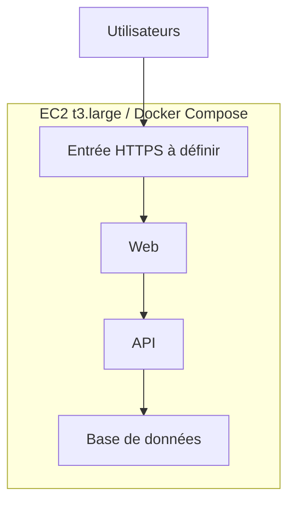

# Déploiement

## État constaté / déclaré

- Instance EC2 créée avec la configuration annoncée dans [l'inventaire](infrastructure.md).
- Docker Engine et Docker Compose installés sur Ubuntu en suivant la [documentation officielle d'installation](https://docs.docker.com/engine/install/ubuntu/). Les versions et la méthode précise d'installation restent à relever.
- Aucun dépôt applicatif, fichier `compose.yaml`, moteur de base de données, nom de domaine ou méthode de livraison de l'application n'a encore été communiqué dans cette documentation.

## Contrôles sur le serveur

À exécuter après connexion SSH ; enregistrer les résultats utiles ci-dessous, sans secret :

```bash
lsb_release -a
docker --version
docker compose version
sudo systemctl is-active docker
sudo docker ps
df -h
free -h
```

| Contrôle | Résultat / date |
| --- | --- |
| Version Ubuntu | **24.04** |
| Version Docker Engine | **29.8.1** |
| Version du plugin Docker Compose | **v5.5** |
| Docker actif | **Oui** |
| Espace libre sur le volume | **30 Go** |

La forme actuelle de Compose est `docker compose` (plugin), à confirmer sur l'hôte avec la commande ci-dessus. Le lien d'installation Docker fourni par l'équipe mentionne `docker-compose-plugin` parmi les paquets installables.

## Architecture envisagée pour la première version

Une instance EC2 peut héberger **plusieurs conteneurs dans un même projet Compose** : par exemple web, API et base de données. Les services, images, ports, volumes et variables ne peuvent être fixés qu'après réception des besoins applicatifs. La base de données ne doit pas publier son port vers Internet ; ses données devront utiliser un volume persistant et une procédure de sauvegarde testée.



Le composant d'entrée HTTPS (proxy inverse, certificat, domaine) est encore **à définir**. Les conteneurs du schéma sont une proposition d'organisation, pas un déploiement déjà réalisé. Pour la production future, revoir la séparation des services, la disponibilité et les sauvegardes selon la charge et les exigences métier.

## Procédure de livraison à compléter avec les développeurs

1. Obtenir le dépôt applicatif, les instructions de build, les images et la liste des services.
2. Définir le fichier `compose.yaml` avec les développeurs : réseaux internes, `healthcheck`, redémarrage, volumes persistants, limites adaptées aux 8 Gio disponibles ; ne publier que les ports nécessaires.
3. Définir l'emplacement des secrets et la personne qui les provisionne sur l'hôte. Garder `.env` et clés hors Git ; committer uniquement un `.env.example` sans valeurs sensibles si utile.
4. Configurer domaine, DNS, HTTPS et groupe de sécurité ; vérifier l'exposition réelle des ports.
5. Définir et tester la sauvegarde/restauration de la base avant toute donnée importante.
6. Fixer les commandes de build, migration et mise à jour propres à la stack. Une fois validées, inscrire ici la procédure exacte et le plan de retour arrière.

**Chemin du projet sur le serveur, dépôt applicatif, responsable des déploiements et environnement : À RENSEIGNER.**